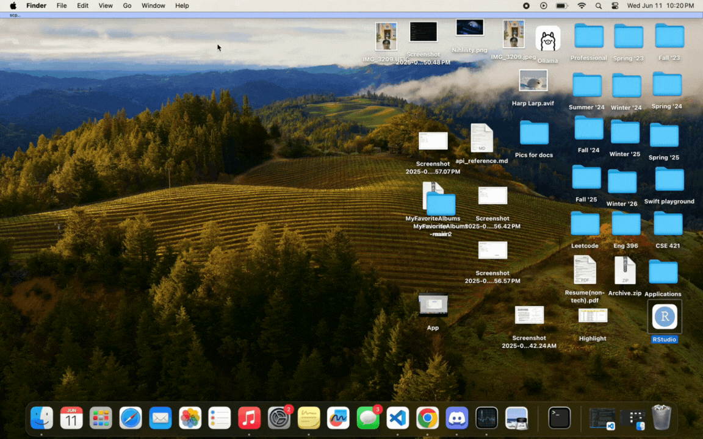

# FAQ (frequently asked questions)

## What type of Mac do I have?
1. Click on the Apple menu in the top-left corner of your screen.
2. Select "About This Mac" from the drop-down menu. Next to "Chip,"
3. it will tell you whether it’s an M-series or Intel.

## What does the line when comparing two bands/artists mean?
The line represents the respective artist's/band's album ratings throughout the years. In other words, it tracks the artist’s critical reception over a period of time using the ratings of their albums and their release dates.

## What does the data set look like?
It’s organized into the following columns:
* **Year:** The year of the music release.
* **Ranking:** The position the album ranked.
* **Album:** The name of the album.
* **Artist:** The name of the artist.
* **Rating:** A score from 1 to 10.
* **Vinyl:** A character noting if there's a vinyl version ('v' if yes, blank if no).
* **EP:** Stands for Extended Play ('EP' if yes, blank if no).
* **Live:** Indicates if there was a live performance ('Live' if yes, blank if no).

## Why isn’t an artist or band on the list?
The dataset is limited to the artists that it contains. To add a new artist, you would need to go into the CSV file and add them manually.

## How do I change the formatting of the CSV/Data?
It is highly recommended that you do not change the formatting of the data, as it is complex and requires significant changes to the code base. If you were to proceed, you would first have to replace the current CSV. Then, you would need to go into every function that uses the CSV and customize the function calls to match your new formatting. For more detailed instructions, please refer to the documentation on changing the CSV file.

## How do I change my working directory in RStudio to my current directory?
In the RStudio terminal, you can use the command `setwd("Wanted directory")`. Alternatively, within the RStudio interface, you can navigate to the "Files" pane, click on the "More" gear button, and select "Set as Working Directory".

## How do I look at my own vinyl?
Once you have linked your own CSV file to the program, you should be able to look under the "Vinyl" tab to see your owned vinyls. For instructions on how to do this, please see the guide on how to make and use your own CSV.

## How do I make my own CSV?
You can create a new CSV file from scratch in Excel or any other spreadsheet application. Just make sure its columns correspond to the columns of the `My Fav Albums CSV`. The other option is to download the current `My Fav Albums CSV`, open it in your preferred spreadsheet app, and add your data from there. Note: The 'Vinyl' column will not reflect your personal vinyl collection unless you modify it.