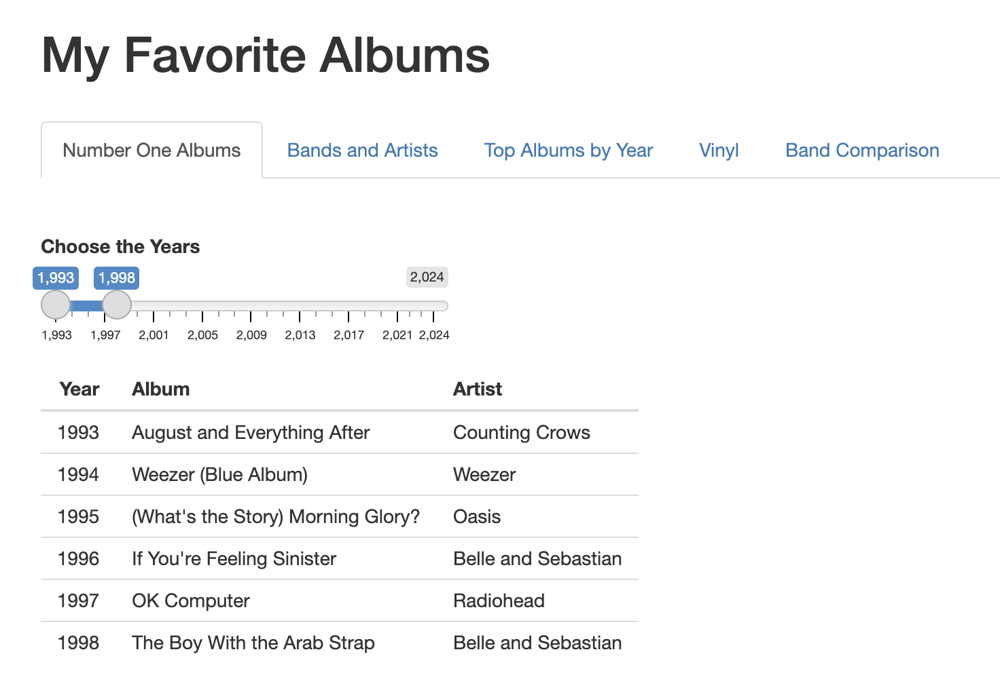

# Home

  ### What Is MyFavoriteAlbum?
  MyFavoriteAlbum is an upcoming website that tracks the top album, band, and single for every year
  from 1993 to 2024. Users can use the website to check the number one album of a particular year,
  check if a band had a number one album, compare bands, and check a personal vinyl collection of the
  creator. The website allows you to add on more analysis through the use of R. It’s a open source
  project that allows interested beginning R devs to learn more about R and added on to a cool website.

# Overview
The website and its associated files are stored in the git repository. A git repository is a folder that stores files online that has various features allowing for collaboration. It allows users to download their own very MyFavoriteAlbum and run it with their dataset. Users can modify the software to their needs for analysis.
# Interface

### Tabs
MyFavoriteAlbum has several pre existing tabs (buttons that take you to a different page of the website) that you can analyze the music data from each tab.

- **Number One Albums:** Allows you to see different top one album according to picked years (default tab)
- **Bands and Artists:** Allows you to see different chosen bands or artists with their associated albums, year and rating.
- **Top Albums By year:** Allows you to see the top albums of the year
- **Vinyl:** Allows you to see the creator’s vinyl or your own given that you are using your dataset.
- **Band Comparison:** Comparing bands on a graph based on their rating and year.

# Prerequisites
While you don't need to be an expert coder, it's helpful if you have some experience with programming—especially if you've dabbled in languages like Python for data analysis to add your own analysis. MyFavoriteAlbum site is built using the basics of R, along with some helpful libraries like Shiny (for web apps), dplyr (for data manipulation), and ggplot2 (for creating beautiful graphics). However, if you want to look at your data info, it's not necessary to have coding experience at all.
