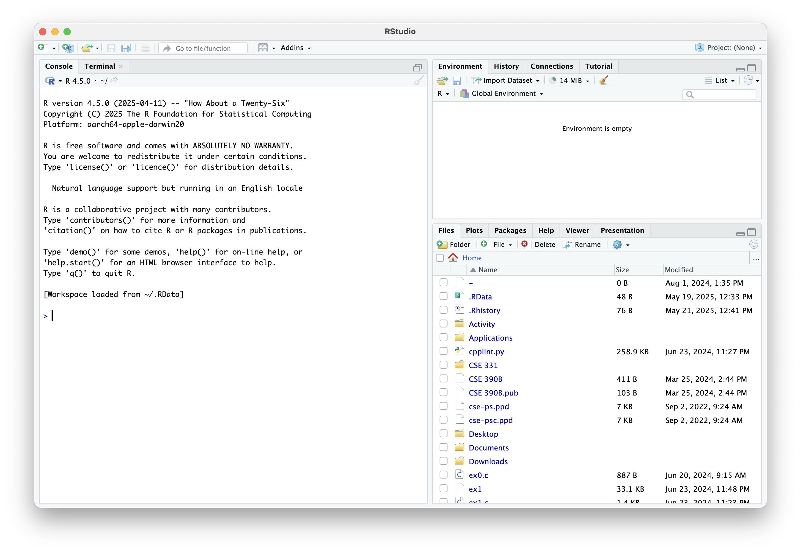
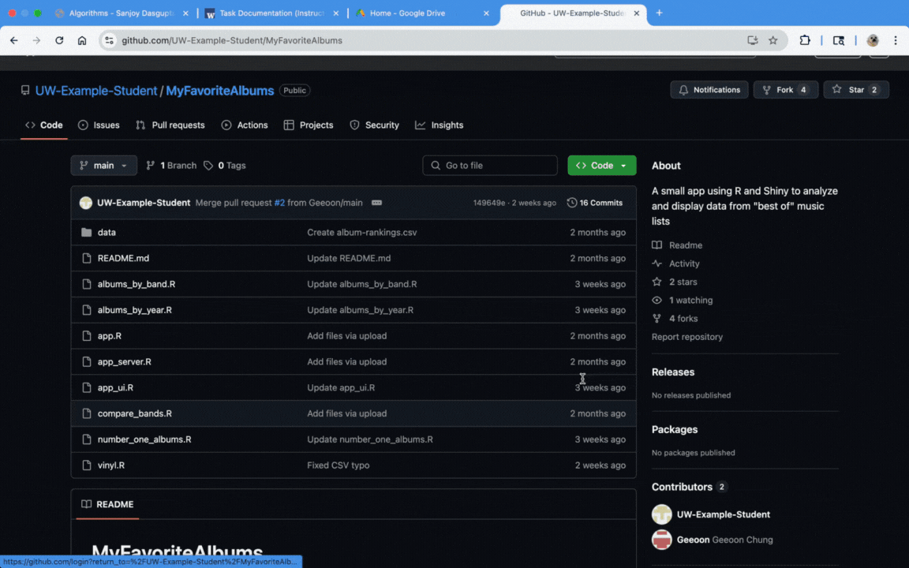
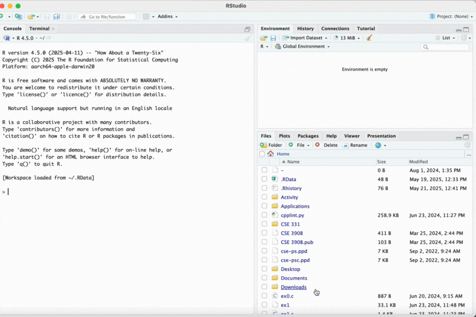

# How to install the software?
  To install MyFavoriteAlbums, you have to install R and Rsudio then install the source code itself and install the packages that is required for the program.

  [Go to Installing R and R studio](#Installing-R-and-R-studio)

  [Go to Installing MyFavoriteAlbums](#installing-myfavoritealbums)

  [Go to Installing required Packages](#installing-packages)

  [Go to Running the program](#Running-a-local-version-of-MyFavoriteAlbums)

## Installing R and R studio

### Part A: Install R
1.  **Go to your respective device R Download Page:**
    * For Windows: [CRAN R for Windows](https://cran.r-project.org/bin/windows/base/)
    * For macOS: [CRAN R for macOS](https://cran.r-project.org/bin/macosx/)

2.  **Download the Correct Installer File:**
    * **On the Windows page:** Click On: "**Install R for the first time**"

    * **On the macOS page:** Download according to your Mac
        * For newer Macs (2020 and after): Download the package labeled "**Apple silicon**".
        * For older Macs (before 2020): Download the package labeled "**Intel**".

3.  **Run the R Installer:**
    * Find the file you just downloaded in your folder and double-click it to begin.
    * Follow the on-screen instructions.

### Part B: Install RStudio
1.  **Go to the RStudio Download Page:** [Posit RStudio Desktop](https://posit.co/download/rstudio-desktop/).

2.  **Download the Installer:**
    * Click download (It doesn't matter what system you're on)

3.  **Run the RStudio Installer:**
    * Find the file you just downloaded in your folder and double-click it to begin.
    * Follow the on-screen instructions.

Now you should've be able to open RStudio and look like the image below

## **Installing MyFavoriteAlbums**
There are two options when installing the actual software itself,
using git fork or downloading the software straight from the git repo.
It's recommended that if you are using the software without modifying it
in any way, download it straight from the repo. Otherwise, it's advisable
to fork the repo to have version control available.

### **Option 1: Installing straight from the repo**
1. Go to the the MyFavoriteAlbums git repository:
[MyFavoriteAlbumns](https://github.com/UW-Example-Student/MyFavoriteAlbums).

2. Click the green button that says < > Code" that will show a drop down.

3. Procced to Click "Download ZIP".

4. Extract the ZIP into a new folder.

### **Option 2: Git cloning**

1. Set up git if you haven't already: [Github Tutorial](https://docs.github.com/en/get-started/git-basics/set-up-git).

2. Open up your terminal, run: "git clone https://github.com/UW-Example-Student/MyFavoriteAlbums.git".

3. Put the folder in a convient place.

## **Installing Packages**

1. Open up Rstudio.

2. In the terminal area of Rstudio, Run the command: “install.packages("shiny")”.

3. Follow the installation instructions inside the terminal.

4. repeat for install.packages("dplyr"), install.packages("ggplot2") and install.packages("DT").

## **Running a local version of MyFavoriteAlbums**

1. Open up Rstudio.

2. Click File -> New project -> Exsting Directory.

3. Load in your downloaded version of MyFavoriteAlbums.

4. Open "app.r" file from MyFavoriteAlbums.

5. On the top right, press run app.

6. A new browser should show up.

