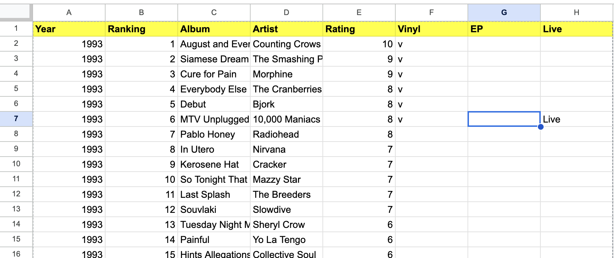

# How to use your own data?

 Warning: CSV file top row's formatting has to be the same as the given csv otherwise the program will not function properly!

**Highlighted cells are the one needed to be preserved**

# Data Layout:

The dataset is contained inside the data folder of the git repository. The data is stored in a CSV (Comma-separated values). A CSV is a storage file that is similar to Excel, where at the top, it tells what each column represents, but in this instance, the values are separated by commas. For the purpose of this software, It is essential to have the same column names as the CSV in the file, as it will avoid headaches with debugging names. The column names follow Year, Ranking, Album, Artist, Rating, Vinyl, EP, and Live.

* **Year:** The year of the music release. -> Integer
* **Ranking:** The position the album ranked. -> Integer
* **Album:** The name of the album. -> String
* **Artist:** The name of the artist. -> String
* **Rating:** A score from 1 to 10. -> Integer (1 - 10)
* **Vinyl:** A character noting if there's a vinyl version -> Char ('v' if yes, blank if no).
* **EP:** Stands for Extended Play  -> String ('EP' if yes, blank if no).
* **Live:** Indicates if there was a live performance  -> String ('Live' if yes, blank if no).

## Changing it to your data

1. Open a folder with your own CSV file.

2. In a seprate tab, navagate to your MyFavoriteAlbums folder.

3. Click on the data folder in MyFavoriteAlbums folder.

4. Delete or rename album-ranking.csv.

5. Rename your own CSV file to album-ranking.csv.

6. Drag and drop your CSV file into the data folder.

7. Run the application.

